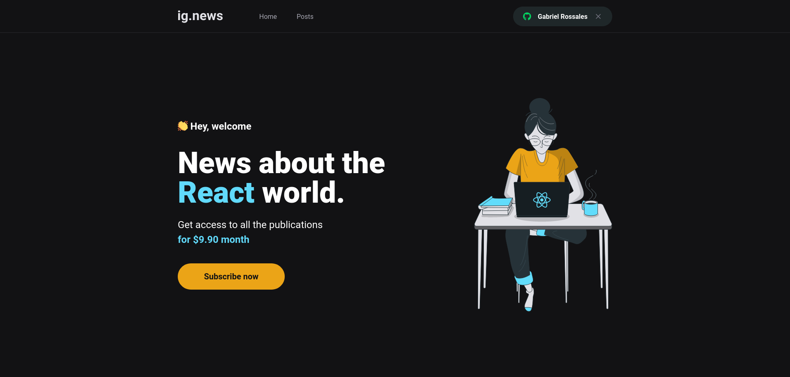
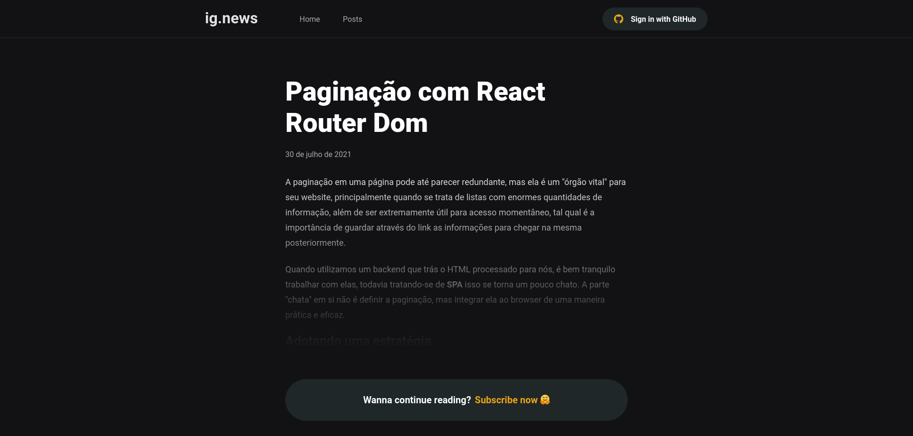
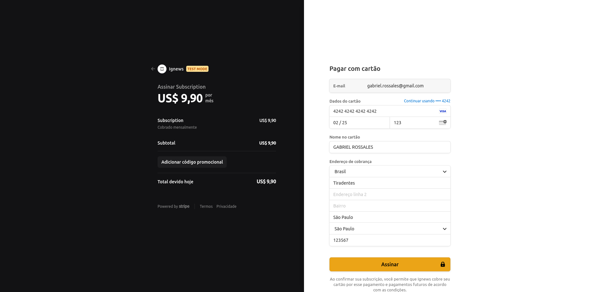
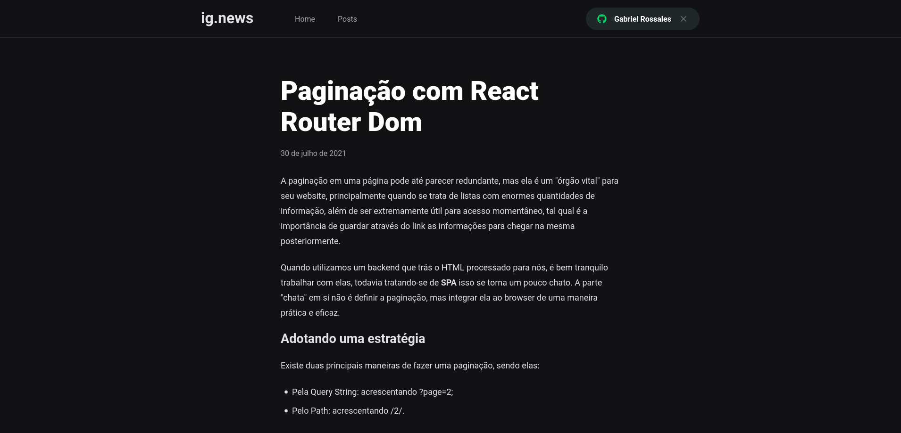

<h1 align="center">


</h1>

<p align="center">
  ig.news
  <br>
  <br>

  

  <a href="https://rocketseat.com.br">
    
  </a>

  <a href="https://linkedin.com/in/gabriel-rossales-a01a51185">
    
  </a>

  <a href="https://github.com/gRossales/ignews/commits/main">
    
  </a>


</p>

---

<p align="center">
  <a href="#about">About</a> &#xa0; | &#xa0; 
  <a href="#built-with">Built With</a> &#xa0; | &#xa0;
  <a href="#prerequisites">Prerequisites</a> &#xa0; | &#xa0;
  <a href="#getting-started">Getting Started</a> &#xa0; &#xa0; | &#xa0;
  <a href="#images">Images</a> &#xa0; &#xa0;
</p>

<br>

## About ##

ig.news is a blog where users can only see it's posts after subscribing.<br>
This app was developed with NextJS, using Stripe for processing payments, NextAuth for github authentication, FaunaDB for keeping user subscription data and Prismic CMS for managing its posts.
<br>
<br>
This is a serverless application that uses JAMStack pattern.


## Built With ##


- [Next.js](https://nextjs.org/)
- [Prismic CMS](https://prismic.io/)
- [Stripe](https://stripe.com/)
- [FaunaDB](https://fauna.com/)

## Prerequisites ##

- [Node](https://nodejs.org/en/)
- [Yarn](https://yarnpkg.com/lang/en/)

## Getting Started ##

```bash
# Clone this project
$ git clone https://github.com/gRossales/ignews

# Access
$ cd ignews

# Install dependencies
$ yarn install

# Run the project
$ yarn dev

# The server will initialize in the <http://localhost:3000>
```
## Images ##

<h1 align="center">
    
    
    
    
</h1>